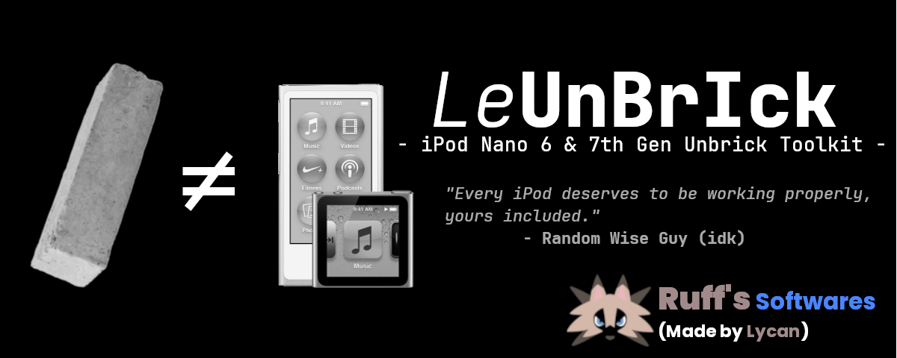
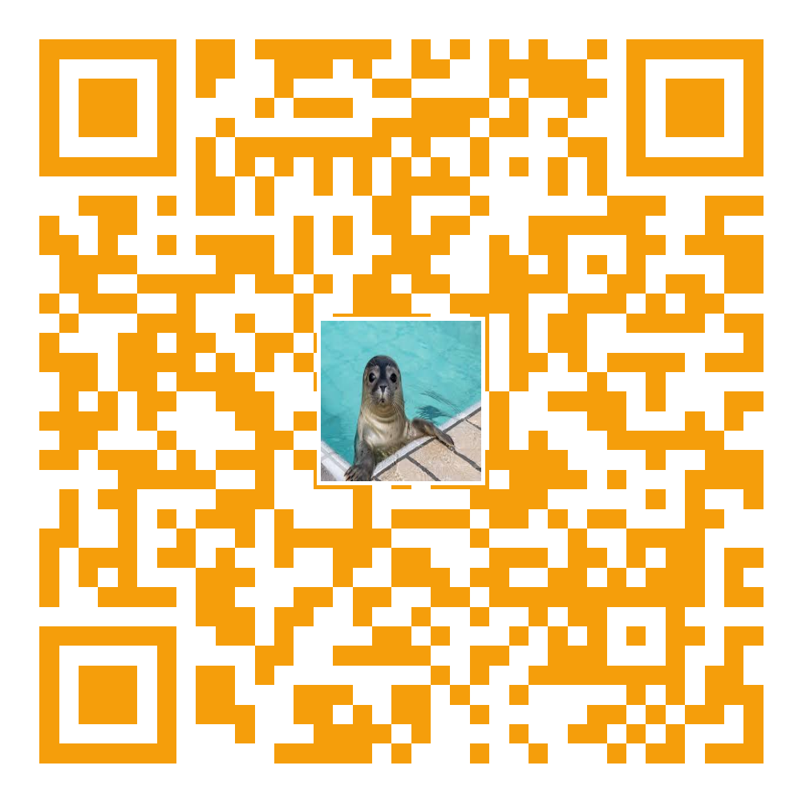

<p align="center">
  
</p>

# 🎧 LeUnBrIck

> ⚡ Universal Unbricker & Flasher for iPod Nano 6th & 7th Gen (2012 & 2015)

`LeUnBrIck` is an all-in-one toolkit for **restoring bricked iPod Nano 6G / 7G devices** using DFU/WTF mode. It supports both the 2012 and 2015 hardware revisions and provides options to flash using **wInd3x** or the **ipodscsi** tool.

---

## 🔧 Features

- ✅ Restore iPod Nano 6G and 7G (2012 & 2015)
- ⚡ Flash WTF & firmware images safely
- ☁️ Auto-download missing `.MSE` firmware files
- 🎨 Colorful and clean TUI interface
- 📦 Automatically installs required tools on major distros

---

## 📥 Requirements

* 🐧 **Linux** (Debian, **Arch**, Alpine, etc.) or **macOS**

  > ✅ *Recommended: Arch Linux on real hardware (A Steam Deck or a Live USB would work)*
* 🪟 **Womp Womp Windows users** (WSL won't work either)

  > 💡 *Tip: Use a Linux Live USB instead*
* 🔌 **USB-A to Lightning** cable
* 📦 Required packages: `dfu-util`, `libusb`, `make`, `go`, `git`

🛠 No need to install these manually — just run the built-in installer.

---

## 🧪 Usage

### 🔹 Step-by-step Guide

```bash
# Clone the repository
git clone https://github.com/lycanld/LeUnBrIck.git

# Move into the project directory
cd LeUnBrIck

# Make the script executable
chmod +x LeUnBrIck.sh

# Launch the unbricker
./LeUnBrIck.sh
````

### 🧙 Inside the Menu

1. **Choose option 4** to install required packages
2. **Choose option 1** if you have a **2012 iPod Nano 7G**
3. **Choose option 2** if you have a **2015 iPod Nano 7G**
4. **Choose option 3** if you have a **iPod Nano 6G**
5. Follow on-screen instructions to enter DFU mode, WTF mode, and complete flashing

---

## 📁 Folder Structure

```
.
├── LeUnBrIck.sh               # Main Bash script
├── wInd3x/                    # wInd3x restore tool
├── ipodscsi_linux/            # ipodscsi restore utility
├── firmwares/                 # WTF/Firmware files (auto-downloaded if missing)
├── assets/
│   └── banner.png             # GitHub banner image
```

---

## 📌 TODO

* [x] Nano 6G support.
* [x] Auto-download `.MSE` files from GitHub
* [x] Upgraded Interface (TUI)
* [ ] GUI (QT / Tkinter)
* [x] Support for both 2012 and 2015 hardware
* [x] MacOS support (accidental but okay)
* [x] Added custom firmware flashing device (not locked to   `/dev/sda`)
* [ ] Improve detection for connected iPod revision
* [ ] Add Windows support.

---

## ⚠️ Notes

* GitHub does **not allow files over 100MB**, so `.MSE` files are **not included**.
* The script will **automatically download** missing firmware files when needed.
* Seeing `LIBUSB_ERROR_NO_DEVICE` at the end of flashing is **normal** and expected.

---
---

## 🙌 Special Thanks

Huge appreciation to the amazing contributors and community members who made this project possible:

- **@LycanLD** — Creator of LeUnBrIck and lead developer  
- **@Ruff** — Packaging, testing, and distribution  
- **@nfzerox** — For ipod_theme
- **@CUB3D** - For ipod_sun
- **@freemyipod** — For wInd3x, freemyipod and ipodscsi
- **@Stefan-Schmidt** — For dfu_utils
- **@760ceb3b9c0ba4872cadf3ce35a7a494** — For ipodhax and other IPSW unpacking scripts (+ He helped me unbrick mine the hard way)
- **@Zeehondie** — Cuz he's a seal

---

## 💬 Join the Community

Want help, mods, or just to show off your themed iPod? Join us on Discord:

- 🎨 **iPod Theme Discord**: [https://discord.com/invite/SfWYYPUAEZ](https://discord.com/invite/SfWYYPUAEZ)
- 🔧 **iPod Modding Discord**: [https://discord.com/invite/7PnGEXjW3X](https://discord.com/invite/7PnGEXjW3X)

<p align="center">
  
</p>

---
## ⭐Remember to give this project a star if you like it / if it worked for you.🌟
---
## 📜 License

MIT License — free to use, fork, and modify.
Contributions welcome!

---

## ✨ Created by [Lycan](https://github.com/lycanld)

### 📦 Distributed by **Ruff's Softwares & Games**
