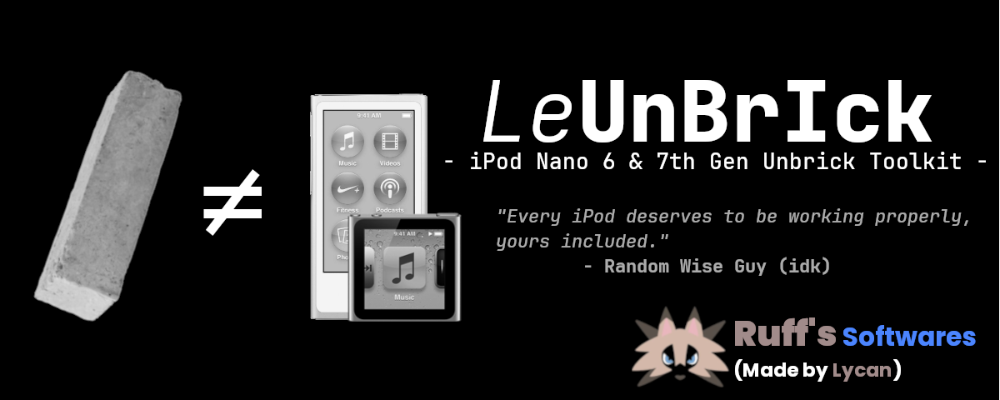
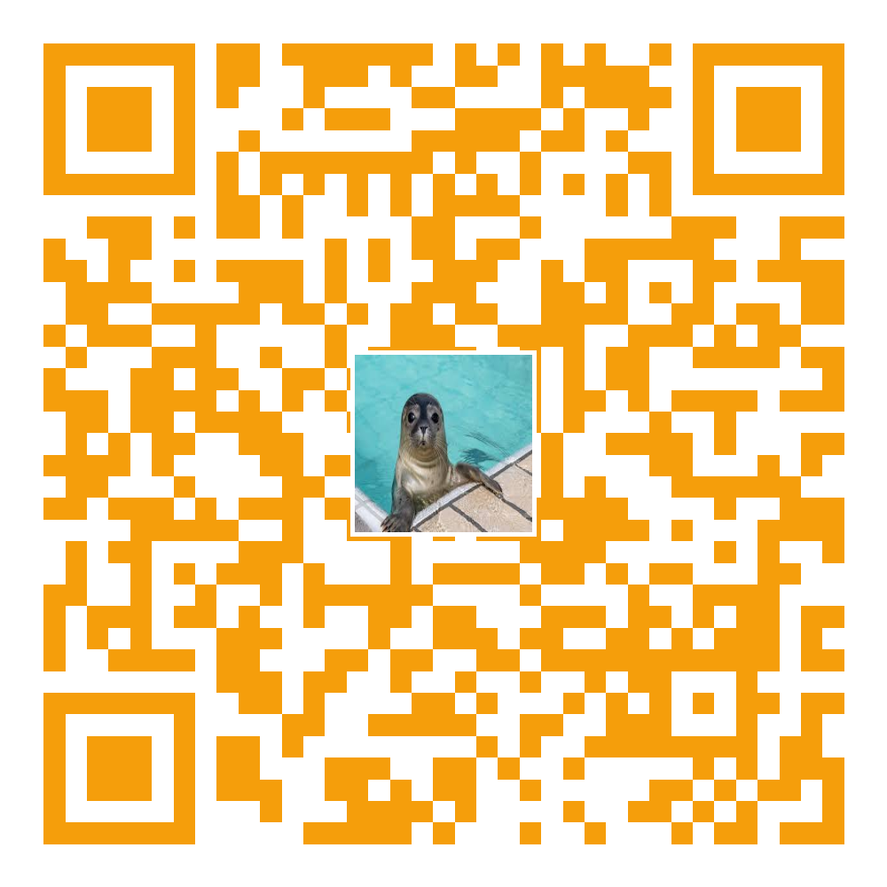

<p align="center">
  
</p>

# 🎧 LeUnBrIck (Now supports Windows)

> ⚡ Universal Unbricker & Flasher for iPod Nano 6th & 7th Gen (2012 & 2015)

`LeUnBrIck` is an all-in-one toolkit for **restoring bricked iPod Nano 6G / 7G devices** using DFU/WTF mode.  
It supports both the 2012 and 2015 hardware revisions and provides options to flash using **wInd3x** or **ipodscsi**.

---

## 🔧 Features

- ✅ Restore iPod Nano 6G and 7G (2012 & 2015)  
- ⚡ Flash WTF & firmware images safely  
- ☁️ Auto-download missing `.MSE` firmware files  
- 🎨 Colorful and clean TUI interface  
- 📦 Automatic installation of required tools on major **Linux** distros  
- 🪟 **Windows Support (BETA)** via `launch.bat`  
- 🖥 Cross-platform (Linux, macOS, Windows)  

---

## 📥 Requirements

### Linux/macOS

* 🐧 **Linux** (Debian, Arch, Alpine, etc.) or **macOS**  
  > ✅ Recommended: Arch Linux on real hardware (Steam Deck or Live USB works)  
* 🔌 **USB-A to Lightning cable**  
* 📦 Required packages: `dfu-util`, `libusb`, `make`, `go`, `git`  

> 🛠 No need to install manually — the built-in installer handles it.

### Windows (BETA)

* 🪟 Windows 7, 8, 10, 11  
* 🐍 Python installed and added to PATH  
* 🔌 **USB-A to Lightning cable**  

> 💡 Tip: Using a Linux Live USB is more reliable for flashing.

---

## 🧪 Usage

### Linux/macOS

```bash
# Clone the repository
git clone https://github.com/lycanld/LeUnBrIck.git

# Move into the project directory
cd LeUnBrIck

# Make the script executable
chmod +x LeUnBrIck.sh

# Launch the unbricker
./LeUnBrIck.sh
````

### Windows (BETA)
0. Clone the repository `git clone https://github.com/lycanld/LeUnBrIck.git`
1. Double-click `LeUnBrIck_Windows.bat` (or run in a Command Prompt)
2. The script will:

   * Check for Python
   * Install `requests` if missing
   * Run `main.py`
3. Follow on-screen instructions to enter DFU/WTF mode and complete flashing

> ⚠️ Ensure your iPod is connected before running.

---

### 🧙 Inside the Menu (Linux/macOS/Windows)

1. **Option 3** — Install required packages
2. **Option 2** — 2012/2015 iPod Nano 7G
3. **Option 1** — iPod Nano 6G
4. Follow instructions to enter DFU/WTF mode and flash
5. **Option 4** — Credits

---

## 📁 Folder Structure

```
.
├── LeUnBrIck.sh               # Main Bash script
├── LeUnBrIck_Windows.bat      # Windows launcher (BETA)
├── main.py                    # Main Python script (Windows)
├── wInd3x/                    # wInd3x restore tool
├── ipodscsi_linux/            # ipodscsi restore utility
├── firmwares/                 # WTF/Firmware files (auto-downloaded)
├── assets/
│   ├── banner.png             # GitHub banner image
│   └── discord_qr.png         # Discord QR code
```

---

## 📌 TODO

* [x] Nano 6G support
* [x] Auto-download `.MSE` files
* [x] Upgraded TUI interface
* [ ] GUI (QT / Tkinter) - Soon
* [x] Support both 2012 and 2015 hardware
* [x] macOS support (accidental but works)
* [x] Custom firmware flashing device (not locked to `/dev/sda`)
* [X] Improve detection of iPod revision
* [x] Windows support (BETA)

---

## ⚠️ Notes

* GitHub does **not allow files >100MB**, so `.MSE` files are **not included**
* Script auto-downloads missing firmware files when needed
* Seeing `LIBUSB_ERROR_NO_DEVICE` at the end of flashing is **normal**
* Windows support is **BETA**; Linux/macOS is recommended for reliability

---

## 🙌 Special Thanks

* **@LycanLD** — Creator & lead developer
* **@Ruff** — Packaging, testing, distribution
* **@nfzerox** — ipod\_theme
* **@CUB3D** — ipod\_sun
* **@freemyipod** — wInd3x, freemyipod, ipodscsi
* **@Stefan-Schmidt** — dfu\_utils
* **@760ceb3b9c0ba4872cadf3ce35a7a494** — ipodhax & IPSW unpacking
* **@Zeehondie** — Seal inspiration

---

## 💬 Join the Community

* 🎨 **iPod Theme Discord**: [https://discord.com/invite/SfWYYPUAEZ](https://discord.com/invite/SfWYYPUAEZ)
* 🔧 **iPod Modding Discord**: [https://discord.com/invite/7PnGEXjW3X](https://discord.com/invite/7PnGEXjW3X)

<p align="center">
  
</p>

---

## ⭐ Give this project a star if it worked for you! 🌟

---

## 📜 License

MIT License — free to use, fork, and modify. Contributions welcome.

---

## ✨ Created by [Lycan](https://github.com/lycanld)

### 📦 Distributed by **Ruff's Softwares & Games**
